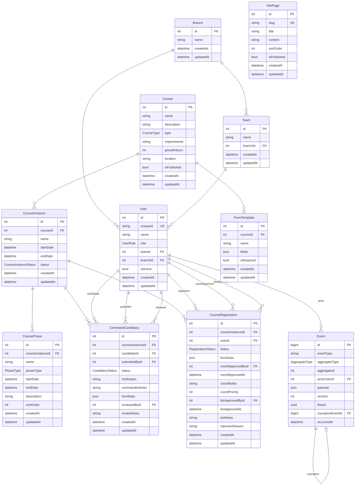

# Database schema

This document describes the PostgreSQL schema managed by [Prisma](./schema.prisma): enums, tables, constraints, and an entity-relationship diagram.

For migrations, see [`migrations/`](./migrations/).

---

## Enums

| Enum                     | Values                                                                                                 |
| ------------------------ | ------------------------------------------------------------------------------------------------------ |
| **UserRole**             | `BIS_CDR`, `BRANCH_COORD`, `TEAM_LEADER`, `TRAINEE`                                                    |
| **CourseType**           | `FOUNDATION`, `ADVANCED`                                                                               |
| **CourseInstanceStatus** | `DRAFT`, `OPEN`, `IN_PROGRESS`, `COMPLETED`                                                            |
| **PhaseType**            | `CANDIDACY_SUBMISSION`, `TRYOUTS`, `COMMANDER_COURSE`, `STAFF_PREP`, `COURSE`, `SUMMARY_WEEK`, `OTHER` |
| **CandidacyStatus**      | `PENDING`, `COORD_REVIEWED`, `APPROVED`, `REJECTED`                                                    |
| **RegistrationStatus**   | `PENDING_COORD`, `PENDING_BIS`, `APPROVED`, `REJECTED`                                                 |
| **AggregateType**        | `USER`, `COURSE`, `COURSE_INSTANCE`, `COURSE_PHASE`, `CANDIDACY`, `REGISTRATION`                       |

---

## Models

Scalar columns only. Relation fields on models (e.g. `team`, `course`) are omitted here; they mirror the foreign keys below.

### Branch

| Column      | Type       | Constraints / default |
| ----------- | ---------- | --------------------- |
| `id`        | `Int`      | PK, autoincrement     |
| `name`      | `String`   | varchar(128)          |
| `createdAt` | `DateTime` | default now           |
| `updatedAt` | `DateTime` | `@updatedAt`          |

### Team

| Column      | Type       | Constraints / default |
| ----------- | ---------- | --------------------- |
| `id`        | `Int`      | PK, autoincrement     |
| `name`      | `String`   | varchar(128)          |
| `branchId`  | `Int`      | FK → `Branch.id`      |
| `createdAt` | `DateTime` | default now           |
| `updatedAt` | `DateTime` | `@updatedAt`          |

### User

| Column      | Type       | Constraints / default |
| ----------- | ---------- | --------------------- |
| `id`        | `Int`      | PK, autoincrement     |
| `uniqueId`  | `String`   | unique, varchar(64)   |
| `name`      | `String`   | varchar(128)          |
| `role`      | `UserRole` |                       |
| `teamId`    | `Int?`     | FK → `Team.id`        |
| `branchId`  | `Int?`     | FK → `Branch.id`      |
| `isActive`  | `Boolean`  | default `true`        |
| `createdAt` | `DateTime` | default now           |
| `updatedAt` | `DateTime` | `@updatedAt`          |

### Course

| Column         | Type         | Constraints / default |
| -------------- | ------------ | --------------------- |
| `id`           | `Int`        | PK, autoincrement     |
| `name`         | `String`     | varchar(256)          |
| `description`  | `String`     | text                  |
| `type`         | `CourseType` |                       |
| `requirements` | `String?`    | text                  |
| `gmushHours`   | `Int?`       |                       |
| `location`     | `String?`    | varchar(256)          |
| `isPublished`  | `Boolean`    | default `false`       |
| `createdAt`    | `DateTime`   | default now           |
| `updatedAt`    | `DateTime`   | `@updatedAt`          |

### CourseInstance

| Column      | Type                   | Constraints / default |
| ----------- | ---------------------- | --------------------- |
| `id`        | `Int`                  | PK, autoincrement     |
| `courseId`  | `Int`                  | FK → `Course.id`      |
| `name`      | `String`               | varchar(128)          |
| `startDate` | `DateTime`             |                       |
| `endDate`   | `DateTime`             |                       |
| `status`    | `CourseInstanceStatus` | default `DRAFT`       |
| `createdAt` | `DateTime`             | default now           |
| `updatedAt` | `DateTime`             | `@updatedAt`          |

### CoursePhase

| Column             | Type        | Constraints / default                      |
| ------------------ | ----------- | ------------------------------------------ |
| `id`               | `Int`       | PK, autoincrement                          |
| `courseInstanceId` | `Int`       | FK → `CourseInstance.id`, onDelete Cascade |
| `name`             | `String`    | varchar(128)                               |
| `phaseType`        | `PhaseType` |                                            |
| `startDate`        | `DateTime`  |                                            |
| `endDate`          | `DateTime`  |                                            |
| `description`      | `String?`   | text                                       |
| `sortOrder`        | `Int`       | default `0`                                |
| `createdAt`        | `DateTime`  | default now                                |
| `updatedAt`        | `DateTime`  | `@updatedAt`                               |

### CommandCandidacy

| Column             | Type              | Constraints / default    |
| ------------------ | ----------------- | ------------------------ |
| `id`               | `Int`             | PK, autoincrement        |
| `courseInstanceId` | `Int`             | FK → `CourseInstance.id` |
| `candidateId`      | `Int`             | FK → `User.id`           |
| `submittedById`    | `Int`             | FK → `User.id`           |
| `status`           | `CandidacyStatus` | default `PENDING`        |
| `motivation`       | `String?`         | text                     |
| `commanderNotes`   | `String?`         | text                     |
| `formData`         | `Json?`           |                          |
| `reviewedById`     | `Int?`            | FK → `User.id`           |
| `reviewNotes`      | `String?`         | text                     |
| `createdAt`        | `DateTime`        | default now              |
| `updatedAt`        | `DateTime`        | `@updatedAt`             |

**Unique:** `@@unique([courseInstanceId, candidateId])`

### CourseRegistration

| Column              | Type                 | Constraints / default    |
| ------------------- | -------------------- | ------------------------ |
| `id`                | `Int`                | PK, autoincrement        |
| `courseInstanceId`  | `Int`                | FK → `CourseInstance.id` |
| `userId`            | `Int`                | FK → `User.id`           |
| `status`            | `RegistrationStatus` | default `PENDING_COORD`  |
| `formData`          | `Json?`              |                          |
| `coordApprovedById` | `Int?`               | FK → `User.id`           |
| `coordApprovedAt`   | `DateTime?`          |                          |
| `coordNotes`        | `String?`            | text                     |
| `coordPriority`     | `Int?`               |                          |
| `bisApprovedById`   | `Int?`               | FK → `User.id`           |
| `bisApprovedAt`     | `DateTime?`          |                          |
| `bisNotes`          | `String?`            | text                     |
| `rejectionReason`   | `String?`            | text                     |
| `createdAt`         | `DateTime`           | default now              |
| `updatedAt`         | `DateTime`           | `@updatedAt`             |

**Unique:** `@@unique([courseInstanceId, userId])`

### FormTemplate

| Column       | Type       | Constraints / default |
| ------------ | ---------- | --------------------- |
| `id`         | `Int`      | PK, autoincrement     |
| `courseId`   | `Int`      | FK → `Course.id`      |
| `name`       | `String`   | varchar(128)          |
| `fields`     | `Json`     |                       |
| `isRequired` | `Boolean`  | default `true`        |
| `createdAt`  | `DateTime` | default now           |
| `updatedAt`  | `DateTime` | `@updatedAt`          |

### InfoPage

| Column        | Type       | Constraints / default |
| ------------- | ---------- | --------------------- |
| `id`          | `Int`      | PK, autoincrement     |
| `slug`        | `String`   | unique, varchar(128)  |
| `title`       | `String`   | varchar(256)          |
| `content`     | `String`   | text                  |
| `sortOrder`   | `Int`      | default `0`           |
| `isPublished` | `Boolean`  | default `false`       |
| `createdAt`   | `DateTime` | default now           |
| `updatedAt`   | `DateTime` | `@updatedAt`          |

### Event

Append-only audit log. **`aggregateType` + `aggregateId`** point at a row in another table **by convention** (e.g. `CANDIDACY` + `CommandCandidacy.id`); there is no foreign key to those tables so one event stream can cover multiple entity kinds.

| Column             | Type            | Constraints / default                         |
| ------------------ | --------------- | --------------------------------------------- |
| `id`               | `BigInt`        | PK, autoincrement                             |
| `eventType`        | `String`        | varchar(64)                                   |
| `aggregateType`    | `AggregateType` |                                               |
| `aggregateId`      | `Int`           | logical id of the aggregate row               |
| `actorUserId`      | `Int?`          | FK → `User.id`                                |
| `payload`          | `Json`          |                                               |
| `version`          | `Int`           | monotonic per `(aggregateType, aggregateId)`  |
| `flowId`           | `String?`       | UUID, optional workflow correlation           |
| `causationEventId` | `BigInt?`       | FK → `Event.id`, optional direct parent event |
| `occurredAt`       | `DateTime`      | default now                                   |

**Unique:** `@@unique([aggregateType, aggregateId, version])`  
**Indexes:** `(aggregateType, aggregateId, occurredAt)`, `(eventType, occurredAt)`, `(actorUserId, occurredAt)`, `(flowId)`

---

## Entity-relationship diagram

Rendered in GitHub, many IDEs, and documentation viewers that support [Mermaid](https://mermaid.js.org/). Optional columns appear in the diagram without a separate notation.

`Event` is only linked by foreign key to `User` (actor) and to itself (causation). It is **not** linked in the database to `Course`, `CommandCandidacy`, etc.; those ties use `aggregateType` / `aggregateId` in application logic.

---

## Additional constraints

- **`CoursePhase` → `CourseInstance`:** `onDelete: Cascade` (deleting an instance removes its phases).
- **Uniqueness:** `User.uniqueId`, `InfoPage.slug`, `Event(aggregateType, aggregateId, version)` as above, plus the composite uniques on `CommandCandidacy` and `CourseRegistration`.
