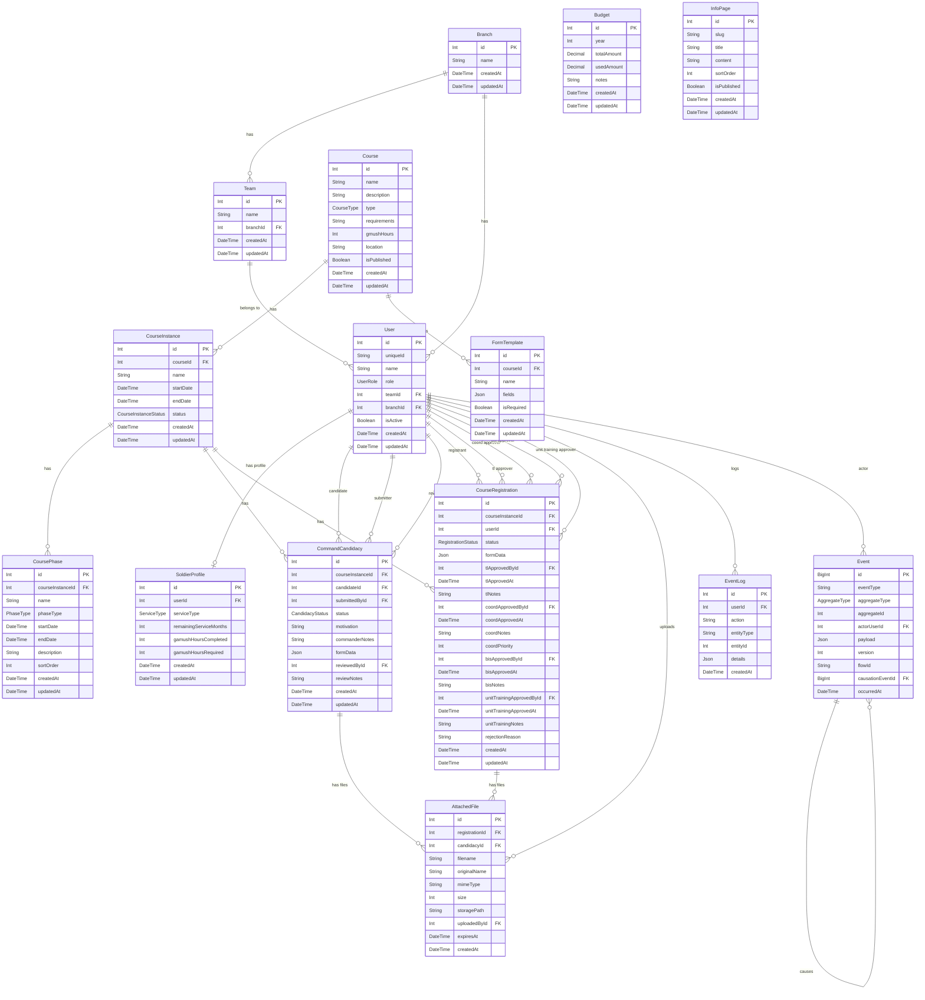
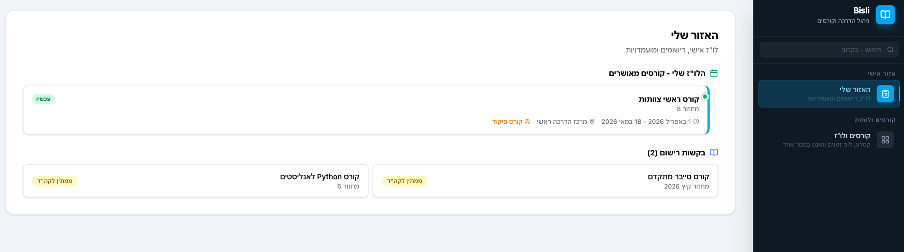
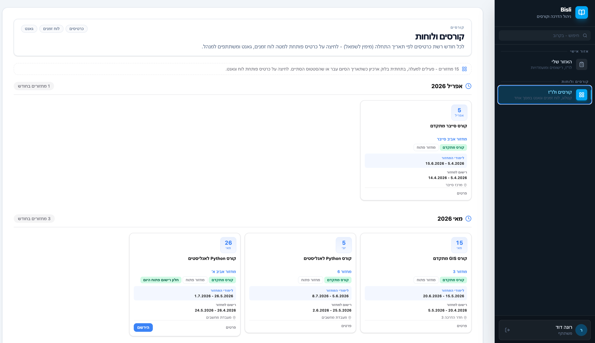
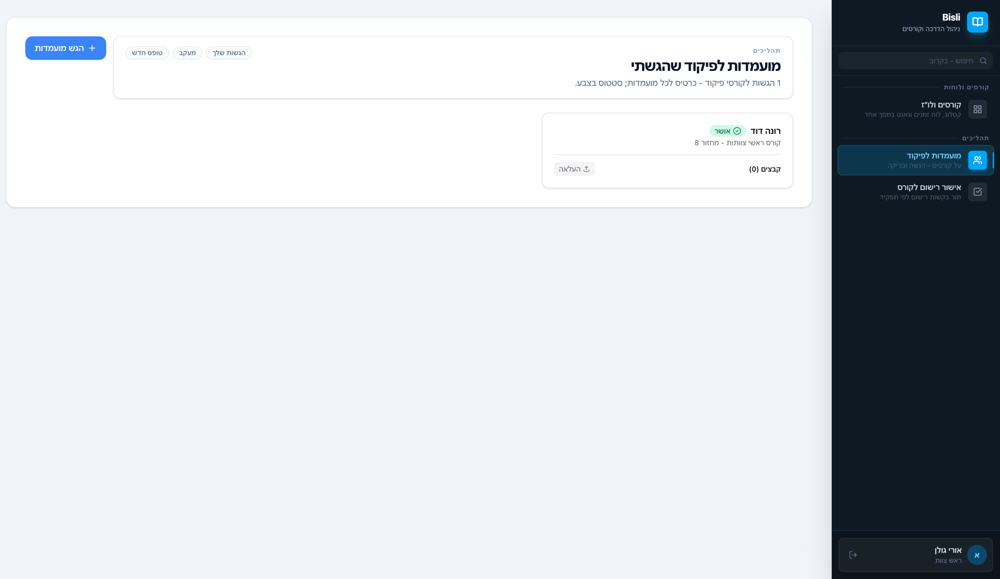
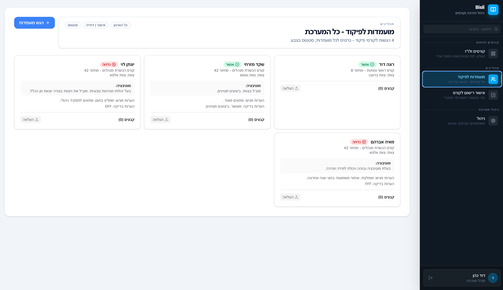

<div dir="rtl">

# Bisli - מפרט מוצר מקיף

> גרסה: 1.0 | עדכון: מאי 2026

---

## תוכן עניינים

1. [ERD - דיאגרמת ישויות](#erd)
2. [טבלאות ושדות](#tables)
3. [API Contracts](#api)
4. [User Stories](#stories)
5. [Task Breakdown](#tasks)
6. [Wireframes](#wireframes)

---

## 1. ERD - דיאגרמת ישויות {#erd}



---

## 2. טבלאות ושדות {#tables}

### 2.1 מבנה ארגוני

#### Branch - ענף

| שדה | סוג | חובה | תיאור |
|-----|-----|------|-------|
| id | Int | כן | מפתח ראשי, autoincrement |
| name | String (128) | כן | שם הענף |
| createdAt | DateTime | כן | תאריך יצירה (אוטומטי) |
| updatedAt | DateTime | כן | תאריך עדכון אחרון (אוטומטי) |

**יחסים:** Branch יכול להכיל ריבוי Teams וריבוי Users

---

#### Team - צוות

| שדה | סוג | חובה | תיאור |
|-----|-----|------|-------|
| id | Int | כן | מפתח ראשי, autoincrement |
| name | String (128) | כן | שם הצוות |
| branchId | Int | כן | מפתח זר ל-Branch |
| createdAt | DateTime | כן | תאריך יצירה |
| updatedAt | DateTime | כן | תאריך עדכון |

**יחסים:** Team שייך לענף אחד; כולל ריבוי Users

---

#### User - משתמש

| שדה | סוג | חובה | תיאור |
|-----|-----|------|-------|
| id | Int | כן | מפתח ראשי |
| uniqueId | String (64) | כן | מספר אישי - ייחודי במערכת |
| name | String (128) | כן | שם מלא |
| role | UserRole enum | כן | תפקיד: BIS_CDR / BRANCH_COORD / TEAM_LEADER / TRAINEE / UNIT_TRAINING |
| teamId | Int | לא | מפתח זר ל-Team (אופציונלי - רלוונטי לטירונים וראשי צוות) |
| branchId | Int | לא | מפתח זר ל-Branch (אופציונלי - רלוונטי לקה"ד) |
| isActive | Boolean | כן | האם המשתמש פעיל (ברירת מחדל: true) |
| createdAt | DateTime | כן | תאריך יצירה |
| updatedAt | DateTime | כן | תאריך עדכון |

**Enum UserRole:**
| ערך | תיאור |
|-----|-------|
| BIS_CDR | מפקד בית ספר - הרשאות מלאות |
| BRANCH_COORD | קה"ד ענפי - מאשר רישום שלב 2 |
| TEAM_LEADER | ראש צוות - מאשר רישום שלב 1, מגיש מועמדויות |
| TRAINEE | משתתף - נרשם לקורסים |
| UNIT_TRAINING | מדור הדרכה יחידתי - שלב אישור 4 |

---

#### SoldierProfile - פרופיל חייל

| שדה | סוג | חובה | תיאור |
|-----|-----|------|-------|
| id | Int | כן | מפתח ראשי |
| userId | Int | כן | מפתח זר ל-User (ייחודי - יחסי 1:1) |
| serviceType | ServiceType enum | כן | סוג שירות: KEVA (קבע) / MANDATORY (חובה) |
| remainingServiceMonths | Int | לא | חודשים נותרים לשחרור (null לקבע) |
| gamushHoursCompleted | Int | כן | שעות גמיש שהושלמו (ברירת מחדל: 0) |
| gamushHoursRequired | Int | כן | שעות גמיש נדרשות (ברירת מחדל: 0) |
| createdAt | DateTime | כן | תאריך יצירה |
| updatedAt | DateTime | כן | תאריך עדכון |

**Enum ServiceType:**
| ערך | תיאור |
|-----|-------|
| KEVA | קבע - שירות קבועה |
| MANDATORY | חובה - שירות חובה |

---

### 2.2 תקציב

#### Budget - תקציב

| שדה | סוג | חובה | תיאור |
|-----|-----|------|-------|
| id | Int | כן | מפתח ראשי |
| year | Int | כן | שנה (ייחודי - מגביל רשומה אחת לשנה) |
| totalAmount | Decimal (12,2) | כן | סכום תקציב שנתי כולל |
| usedAmount | Decimal (12,2) | כן | סכום שנוצל (ברירת מחדל: 0) |
| notes | String | לא | הערות חופשיות |
| createdAt | DateTime | כן | תאריך יצירה |
| updatedAt | DateTime | כן | תאריך עדכון |

---

### 2.3 קטלוג קורסים

#### Course - קורס

| שדה | סוג | חובה | תיאור |
|-----|-----|------|-------|
| id | Int | כן | מפתח ראשי |
| name | String (256) | כן | שם הקורס |
| description | String (Text) | כן | תיאור מלא |
| type | CourseType enum | כן | סוג: FOUNDATION / ADVANCED / LEADERSHIP |
| requirements | String (Text) | לא | דרישות קדם |
| gmushHours | Int | לא | מכסת שעות גמיש |
| location | String (256) | לא | מיקום הקורס |
| isPublished | Boolean | כן | פורסם לציבור (ברירת מחדל: false) |
| createdAt | DateTime | כן | תאריך יצירה |
| updatedAt | DateTime | כן | תאריך עדכון |

**Enum CourseType:**
| ערך | תיאור |
|-----|-------|
| FOUNDATION | קורס יסוד - מסלול בסיסי |
| ADVANCED | קורס מתקדם - 3 שלבי אישור |
| LEADERSHIP | קורס הובלה - דורש מועמדות |

---

#### CourseInstance - מחזור קורס

| שדה | סוג | חובה | תיאור |
|-----|-----|------|-------|
| id | Int | כן | מפתח ראשי |
| courseId | Int | כן | מפתח זר ל-Course |
| name | String (128) | כן | שם המחזור (למשל "מחזור א' 2026") |
| startDate | DateTime | כן | תאריך התחלה |
| endDate | DateTime | כן | תאריך סיום |
| status | CourseInstanceStatus enum | כן | סטטוס (ברירת מחדל: DRAFT) |
| createdAt | DateTime | כן | תאריך יצירה |
| updatedAt | DateTime | כן | תאריך עדכון |

**Enum CourseInstanceStatus:**
| ערך | תיאור |
|-----|-------|
| DRAFT | טיוטה - לא גלוי למשתמשים |
| OPEN | פתוח לרישום |
| IN_PROGRESS | מתנהל כרגע |
| COMPLETED | הסתיים |

---

#### CoursePhase - שלב מחזור (גאנט)

| שדה | סוג | חובה | תיאור |
|-----|-----|------|-------|
| id | Int | כן | מפתח ראשי |
| courseInstanceId | Int | כן | מפתח זר ל-CourseInstance |
| name | String (128) | כן | שם השלב |
| phaseType | PhaseType enum | כן | סוג השלב |
| startDate | DateTime | כן | תאריך התחלת שלב |
| endDate | DateTime | כן | תאריך סיום שלב |
| description | String (Text) | לא | תיאור השלב |
| sortOrder | Int | כן | סדר תצוגה (ברירת מחדל: 0) |
| createdAt | DateTime | כן | תאריך יצירה |
| updatedAt | DateTime | כן | תאריך עדכון |

**Enum PhaseType:**
| ערך | תיאור |
|-----|-------|
| CANDIDACY_SUBMISSION | הגשת מועמדויות |
| TRYOUTS | מיונים |
| COMMANDER_COURSE | קורס מפקדים |
| STAFF_PREP | הכנת סגל |
| COURSE | הקורס עצמו |
| SUMMARY_WEEK | שבוע סיכום |
| OTHER | אחר |

---

### 2.4 מועמדות לפיקוד

#### CommandCandidacy - מועמדות לפיקוד

| שדה | סוג | חובה | תיאור |
|-----|-----|------|-------|
| id | Int | כן | מפתח ראשי |
| courseInstanceId | Int | כן | מפתח זר ל-CourseInstance |
| candidateId | Int | כן | מפתח זר ל-User (המועמד) |
| submittedById | Int | כן | מפתח זר ל-User (מי הגיש - ראש צוות) |
| status | CandidacyStatus enum | כן | סטטוס (ברירת מחדל: PENDING) |
| motivation | String (Text) | לא | מוטיבציה - טקסט חופשי |
| commanderNotes | String (Text) | לא | הערות מפקד - ראש הצוות |
| formData | Json | לא | נתוני טופס נוספים |
| reviewedById | Int | לא | מי סקר (מפקד בי"ס) |
| reviewNotes | String (Text) | לא | הערות הסוקר |
| createdAt | DateTime | כן | תאריך יצירה |
| updatedAt | DateTime | כן | תאריך עדכון |

**Constraint:** ייחודי על (courseInstanceId, candidateId) - מועמד לא יכול להגיש פעמיים לאותו מחזור

**Enum CandidacyStatus:**
| ערך | תיאור |
|-----|-------|
| PENDING | ממתין לבדיקה |
| COORD_REVIEWED | נבדק על ידי קה"ד |
| APPROVED | אושר על ידי מפקד בי"ס |
| REJECTED | נדחה |

---

### 2.5 רישום לקורס

#### CourseRegistration - רישום לקורס

| שדה | סוג | חובה | תיאור |
|-----|-----|------|-------|
| id | Int | כן | מפתח ראשי |
| courseInstanceId | Int | כן | מפתח זר ל-CourseInstance |
| userId | Int | כן | מפתח זר ל-User (הנרשם) |
| status | RegistrationStatus enum | כן | סטטוס (ברירת מחדל: PENDING_TL) |
| formData | Json | לא | נתוני טופס |
| tlApprovedById | Int | לא | ראש צוות שאישר |
| tlApprovedAt | DateTime | לא | מועד אישור ראש צוות |
| tlNotes | String (Text) | לא | הערות ראש צוות |
| coordApprovedById | Int | לא | קה"ד שאישר |
| coordApprovedAt | DateTime | לא | מועד אישור קה"ד |
| coordNotes | String (Text) | לא | הערות קה"ד |
| coordPriority | Int | לא | תיעדוף ענפי (מספר עדיפות) |
| bisApprovedById | Int | לא | מפקד בי"ס שאישר |
| bisApprovedAt | DateTime | לא | מועד אישור מפקד בי"ס |
| bisNotes | String (Text) | לא | הערות מפקד בי"ס |
| unitTrainingApprovedById | Int | לא | מדור הדרכה שאישר |
| unitTrainingApprovedAt | DateTime | לא | מועד אישור מדור הדרכה |
| unitTrainingNotes | String (Text) | לא | הערות מדור הדרכה |
| rejectionReason | String (Text) | לא | סיבת דחייה (כל שלב) |
| createdAt | DateTime | כן | תאריך יצירה |
| updatedAt | DateTime | כן | תאריך עדכון |

**Constraint:** ייחודי על (courseInstanceId, userId) - נרשם לא יכול להירשם פעמיים

**Enum RegistrationStatus:**
| ערך | תיאור | מי מטפל |
|-----|-------|---------|
| PENDING_TL | ממתין לאישור ראש צוות | TEAM_LEADER |
| PENDING_COORD | ממתין לאישור קה"ד ענפי | BRANCH_COORD |
| PENDING_BIS | ממתין לאישור מפקד בי"ס | BIS_CDR |
| APPROVED | אושר סופית | - |
| REJECTED | נדחה | - |

---

### 2.6 קבצים מצורפים

#### AttachedFile - קובץ מצורף

| שדה | סוג | חובה | תיאור |
|-----|-----|------|-------|
| id | Int | כן | מפתח ראשי |
| registrationId | Int | לא | מפתח זר ל-CourseRegistration (או null) |
| candidacyId | Int | לא | מפתח זר ל-CommandCandidacy (או null) |
| filename | String (256) | כן | שם קובץ אחסון (UUID + extension) |
| originalName | String (256) | כן | שם קובץ מקורי |
| mimeType | String (128) | כן | סוג MIME |
| size | Int | כן | גודל בבייטים |
| storagePath | String (512) | כן | נתיב ב-MinIO |
| uploadedById | Int | כן | מפתח זר ל-User שהעלה |
| expiresAt | DateTime | לא | תאריך תפוגה (TTL אוטומטי - 3 חודשים) |
| createdAt | DateTime | כן | תאריך העלאה |

**סוגי קבצים מורשים:** PDF, JPEG, PNG, WebP, DOC, DOCX, XLS, XLSX
**גודל מקסימלי:** 20MB

---

### 2.7 טפסים ומידע

#### FormTemplate - תבנית טופס

| שדה | סוג | חובה | תיאור |
|-----|-----|------|-------|
| id | Int | כן | מפתח ראשי |
| courseId | Int | כן | מפתח זר ל-Course |
| name | String (128) | כן | שם התבנית |
| fields | Json | כן | הגדרת שדות הטופס |
| isRequired | Boolean | כן | חובה למלא (ברירת מחדל: true) |
| createdAt | DateTime | כן | תאריך יצירה |
| updatedAt | DateTime | כן | תאריך עדכון |

---

#### InfoPage - עמוד מידע

| שדה | סוג | חובה | תיאור |
|-----|-----|------|-------|
| id | Int | כן | מפתח ראשי |
| slug | String (128) | כן | מזהה URL ייחודי |
| title | String (256) | כן | כותרת |
| content | String (Text) | כן | תוכן (Markdown/HTML) |
| sortOrder | Int | כן | סדר תצוגה (ברירת מחדל: 0) |
| isPublished | Boolean | כן | פורסם (ברירת מחדל: false) |
| createdAt | DateTime | כן | תאריך יצירה |
| updatedAt | DateTime | כן | תאריך עדכון |

---

### 2.8 לוגים ואירועים

#### EventLog - יומן פעולות (legacy audit)

| שדה | סוג | חובה | תיאור |
|-----|-----|------|-------|
| id | Int | כן | מפתח ראשי |
| userId | Int | כן | מפתח זר ל-User שביצע הפעולה |
| action | String (64) | כן | סוג הפעולה (LOGIN, SUBMIT, APPROVE, REJECT, UPLOAD_FILE, DELETE_FILE, REGISTER) |
| entityType | String (64) | כן | סוג הישות (USER, CANDIDACY, REGISTRATION, ATTACHED_FILE) |
| entityId | Int | לא | מזהה הישות |
| details | Json | לא | פרטים נוספים |
| createdAt | DateTime | כן | מועד הפעולה |

---

#### Event - אירועי דומיין (append-only event store)

| שדה | סוג | חובה | תיאור |
|-----|-----|------|-------|
| id | BigInt | כן | מפתח ראשי |
| eventType | String (64) | כן | סוג האירוע (למשל registration.submitted) |
| aggregateType | AggregateType enum | כן | סוג האגרגט |
| aggregateId | Int | כן | מזהה האגרגט |
| actorUserId | Int | לא | מפתח זר ל-User שגרם לאירוע |
| payload | Json | כן | מטען מלא של האירוע |
| version | Int | כן | גרסה (לעמידה בסדר) |
| flowId | String (UUID) | לא | קישור בין אירועים בתהליך אחד |
| causationEventId | BigInt | לא | אירוע שגרם לאירוע זה |
| occurredAt | DateTime | כן | מועד האירוע |

**Enum AggregateType:** USER | COURSE | COURSE_INSTANCE | COURSE_PHASE | CANDIDACY | REGISTRATION

---

## 3. API Contracts {#api}

> **הערה:** אימות מתבצע דרך header: `x-user-id: <userId>`
> Auth כולל: `authenticate` (בדיקת קיום header) + `requireRole(...)` (בדיקת תפקיד)

### 3.1 Health

| Method | Path | Auth | Request Body | Response | תיאור |
|--------|------|------|-------------|----------|-------|
| GET | `/api/health/ready` | ללא | - | `{ status: "ok" }` | בדיקת חיות - DB ping |

---

### 3.2 Auth / Users

| Method | Path | Auth | Request Body | Response | תיאור |
|--------|------|------|-------------|----------|-------|
| POST | `/api/auth/login` | ללא | `{ uniqueId: string }` | User object עם team + branch | כניסה לפי מספר אישי |
| GET | `/api/auth/me` | x-user-id header | - | User object עם team + branch | פרטי המשתמש המחובר |
| GET | `/api/auth/users` | ללא | - | User[] עם team + branch | רשימת כל המשתמשים |
| GET | `/api/auth/team/:teamId/members` | ללא | - | User[] (TRAINEE בצוות) | חברי צוות לפי teamId |
| POST | `/api/auth/users` | BIS_CDR | `{ uniqueId, name, role, teamId?, branchId? }` | User object (201) | יצירת משתמש חדש |
| PATCH | `/api/auth/users/:id` | BIS_CDR | `{ name?, role?, teamId?, branchId?, isActive? }` | User object | עדכון משתמש |

---

### 3.3 Branches

| Method | Path | Auth | Request Body | Response | תיאור |
|--------|------|------|-------------|----------|-------|
| GET | `/api/branches` | ללא | - | Branch[] עם teams | רשימת כל הענפים |
| GET | `/api/branches/:id/teams` | ללא | - | Team[] | צוותות של ענף ספציפי |
| POST | `/api/branches` | BIS_CDR | `{ name: string }` | Branch object (201) | יצירת ענף |
| POST | `/api/branches/teams` | BIS_CDR | `{ name: string, branchId: number }` | Team object (201) | יצירת צוות |

---

### 3.4 Courses

| Method | Path | Auth | Request Body | Response | תיאור |
|--------|------|------|-------------|----------|-------|
| GET | `/api/courses` | אופציונלי (x-user-id) | - | Course[] עם instances פעילים | קטלוג קורסים. BIS_CDR רואה גם DRAFT |
| GET | `/api/courses/:id` | ללא | - | Course עם instances + formTemplates | פרטי קורס מלאים |
| POST | `/api/courses` | BIS_CDR | `{ name, description, type, requirements?, gmushHours?, location?, isPublished? }` | Course object (201) | יצירת קורס |
| PATCH | `/api/courses/:id` | BIS_CDR | Partial course fields | Course object | עדכון קורס |
| GET | `/api/courses/:id/instances` | ללא | - | CourseInstance[] עם phases | מחזורים של קורס |
| POST | `/api/courses/:id/instances` | BIS_CDR | `{ name, startDate, endDate }` | CourseInstance (201) | יצירת מחזור |

---

### 3.5 Gantt

| Method | Path | Auth | Request Body | Response | תיאור |
|--------|------|------|-------------|----------|-------|
| GET | `/api/gantt` | ללא | - | CourseInstance[] עם phases + course | מחזורים פעילים לתצוגת גאנט |
| POST | `/api/gantt/instances/:instanceId/phases` | BIS_CDR | `{ name, phaseType, startDate, endDate, description?, sortOrder? }` | CoursePhase (201) | הוספת שלב למחזור |
| PATCH | `/api/gantt/phases/:id` | BIS_CDR | Partial phase fields | CoursePhase | עדכון שלב |
| DELETE | `/api/gantt/phases/:id` | BIS_CDR | - | 204 No Content | מחיקת שלב |

---

### 3.6 Candidacy

| Method | Path | Auth | Request Body | Response | תיאור |
|--------|------|------|-------------|----------|-------|
| POST | `/api/candidacy/submit` | TEAM_LEADER, BIS_CDR | `{ courseInstanceId, candidateId, motivation?, commanderNotes? }` | CommandCandidacy (201) | הגשת מועמדות לפיקוד |
| GET | `/api/candidacy/my-submissions` | TEAM_LEADER | - | CommandCandidacy[] עם candidate + courseInstance | מועמדויות שהגיש ראש הצוות |
| GET | `/api/candidacy/mine` | TRAINEE | - | CommandCandidacy[] עם submittedBy + courseInstance | מועמדויות עבור המשתתף |
| GET | `/api/candidacy/branch` | BRANCH_COORD | - | CommandCandidacy[] עם candidate + team | מועמדויות בענף |
| PATCH | `/api/candidacy/:id/coord-review` | BRANCH_COORD | - | CommandCandidacy | סימון נסקר על ידי קה"ד |
| GET | `/api/candidacy/all` | BIS_CDR | - | CommandCandidacy[] מלאים | כל המועמדויות |
| PATCH | `/api/candidacy/:id/approve` | BIS_CDR | `{ reviewNotes?: string }` | CommandCandidacy | אישור מועמדות |
| PATCH | `/api/candidacy/:id/reject` | BIS_CDR | `{ reviewNotes?: string }` | CommandCandidacy | דחיית מועמדות |

---

### 3.7 Registrations

| Method | Path | Auth | Request Body | Response | תיאור |
|--------|------|------|-------------|----------|-------|
| GET | `/api/registrations/by-instance/:instanceId` | BIS_CDR, BRANCH_COORD, TEAM_LEADER | - | CourseRegistration[] עם user + approvers | רישומים למחזור ספציפי |
| POST | `/api/registrations/manual` | BIS_CDR | `{ courseInstanceId, userId, status? }` | CourseRegistration (201) | רישום ידני על ידי מנהל |
| POST | `/api/registrations/advanced` | TRAINEE, TEAM_LEADER, BIS_CDR | `{ courseInstanceId, formData? }` | CourseRegistration (201) | הגשת בקשת רישום |
| GET | `/api/registrations/mine` | TRAINEE | - | CourseRegistration[] עם courseInstance | הרישומים שלי |
| GET | `/api/registrations/team` | TEAM_LEADER | - | CourseRegistration[] ב-PENDING_TL | בקשות ממתינות לאישור ראש צוות |
| GET | `/api/registrations/branch` | BRANCH_COORD | - | CourseRegistration[] מהענף | כל הרישומים בענף |
| PATCH | `/api/registrations/:id/approve-tl` | TEAM_LEADER | `{ tlNotes?: string }` | CourseRegistration | ראש צוות מאשר - עובר ל-PENDING_COORD |
| PATCH | `/api/registrations/:id/prioritize` | BRANCH_COORD | `{ coordNotes?, coordPriority? }` | CourseRegistration | קה"ד מאשר ומתעדף - עובר ל-PENDING_BIS |
| GET | `/api/registrations/all` | BIS_CDR | - | CourseRegistration[] מלאים | כל הרישומים |
| PATCH | `/api/registrations/:id/approve-final` | BIS_CDR | `{ bisNotes?: string }` | CourseRegistration | אישור סופי - עובר ל-APPROVED |
| PATCH | `/api/registrations/:id/reject` | BRANCH_COORD, BIS_CDR | `{ rejectionReason?: string }` | CourseRegistration | דחיית בקשת רישום |

---

### 3.8 Files

| Method | Path | Auth | Request Body | Response | תיאור |
|--------|------|------|-------------|----------|-------|
| POST | `/api/files/upload/registration/:registrationId` | authenticate | multipart/form-data (קובץ) | AttachedFile (201) | העלאת קובץ לרישום |
| POST | `/api/files/upload/candidacy/:candidacyId` | authenticate | multipart/form-data (קובץ) | AttachedFile (201) | העלאת קובץ למועמדות |
| POST | `/api/files/upload/:registrationId` | authenticate | multipart/form-data (קובץ) | AttachedFile (201) | Legacy - העלאה לרישום |
| GET | `/api/files/list/registration/:registrationId` | authenticate | - | AttachedFile[] עם uploadedBy | רשימת קבצי רישום |
| GET | `/api/files/list/candidacy/:candidacyId` | authenticate | - | AttachedFile[] עם uploadedBy | רשימת קבצי מועמדות |
| GET | `/api/files/list/:registrationId` | authenticate | - | AttachedFile[] | Legacy - רשימת קבצי רישום |
| GET | `/api/files/download/:id` | ללא (browser link) | - | File binary | הורדת קובץ |
| GET | `/api/files/view/:id` | ללא (browser link) | - | File binary (inline) | צפייה בקובץ בדפדפן |
| DELETE | `/api/files/:id` | authenticate | - | 204 No Content | מחיקת קובץ |

---

### 3.9 Info Pages

| Method | Path | Auth | Request Body | Response | תיאור |
|--------|------|------|-------------|----------|-------|
| GET | `/api/info` | ללא | - | InfoPage[] (isPublished=true) | עמודי מידע פורסמו |
| GET | `/api/info/:slug` | ללא | - | InfoPage | עמוד מידע לפי slug |
| POST | `/api/info` | BIS_CDR | `{ slug, title, content, sortOrder?, isPublished? }` | InfoPage (201) | יצירת עמוד מידע |
| PATCH | `/api/info/:id` | BIS_CDR | Partial InfoPage | InfoPage | עדכון עמוד מידע |

---

### 3.10 Events (Audit Log)

| Method | Path | Auth | Query Params | Response | תיאור |
|--------|------|------|-------------|----------|-------|
| GET | `/api/events` | BIS_CDR | `action?, entityType?, userId?, from?, to?, limit?` | EventLog[] עם user | יומן פעולות עם פילטרים |

---

## 4. User Stories {#stories}

### 4.1 רישום לקורס

---

**US-REG-01: הגשת בקשת רישום**

> בתור **משתתף (TRAINEE)** אני רוצה **לבחור קורס ולהגיש בקשת רישום למחזור** כדי **להצטרף לתוכנית הדרכה**

**קריטריוני קבלה:**
- אני רואה רשימת קורסים פורסמו בלבד
- אני יכול לפתוח פרטי קורס ולבחור מחזור פעיל
- אני יכול לצרף קבצים (עד 20MB, סוגים מורשים)
- לאחר הגשה הבקשה מופיעה בסטטוס PENDING_TL
- אני מקבל הודעת אישור על ההגשה
- לא ניתן לשלוח בקשה כפולה לאותו מחזור

---

**US-REG-02: אישור ראש צוות**

> בתור **ראש צוות (TEAM_LEADER)** אני רוצה **לראות בקשות רישום הממתינות לאישורי** כדי **לאשר או לדחות תחת פיקוחי**

**קריטריוני קבלה:**
- אני רואה badge עם מספר הבקשות הממתינות בסיידבר
- אני רואה רק בקשות עם סטטוס PENDING_TL מהצוות שלי
- לכל בקשה אני יכול לאשר (עם הערות) - עוברת ל-PENDING_COORD
- לכל בקשה אני יכול לדחות עם סיבת דחייה
- אחרי אישור/דחייה הבקשה נעלמת מהרשימה שלי

---

**US-REG-03: אישור קה"ד ענפי**

> בתור **קה"ד ענפי (BRANCH_COORD)** אני רוצה **לסקור ולתעדף בקשות מהענף שלי** כדי **להמליץ למפקד בי"ס בסדר עדיפות**

**קריטריוני קבלה:**
- אני רואה בקשות מכל הצוותות בענפי בסטטוס PENDING_COORD
- אני יכול להגדיר מספר תיעדוף (coordPriority) לכל בקשה
- אישור מעביר בקשה ל-PENDING_BIS
- אני יכול לדחות עם סיבה בכל שלב
- אני רואה היסטוריית אישורי ראש הצוות (tlNotes)

---

**US-REG-04: אישור סופי מפקד בי"ס**

> בתור **מפקד בי"ס (BIS_CDR)** אני רוצה **לראות כל הבקשות שהגיעו לאישורי הסופי** כדי **להחליט מי מאושר לקורס**

**קריטריוני קבלה:**
- אני רואה בקשות בסטטוס PENDING_BIS עם כל ההיסטוריה
- אני רואה את תיעדוף הקה"ד לכל בקשה
- אישור מעביר ל-APPROVED
- אני יכול לדחות עם סיבה
- אני יכול לרשום משתתף ידנית (bypass workflow) עם סטטוס APPROVED

---

**US-REG-05: מעקב סטטוס**

> בתור **משתתף (TRAINEE)** אני רוצה **לעקוב אחר מצב הבקשות שלי** כדי **לדעת היכן עומדת הבקשה**

**קריטריוני קבלה:**
- אני רואה את כל הרישומים שלי עם סטטוס עדכני
- כשנדחיתי - אני רואה את סיבת הדחייה
- כשאושרתי - הקורס מופיע בטיימליין הקורסים שלי
- תצוגת badge צבעוני לפי סטטוס

---

### 4.2 מועמדות לפיקוד

---

**US-CAND-01: הגשת מועמדות**

> בתור **ראש צוות (TEAM_LEADER)** אני רוצה **להגיש מועמדות עבור חייל מהצוות שלי לקורס יסוד/הובלה** כדי **לאפשר לו להתמודד על תפקיד פיקוד**

**קריטריוני קבלה:**
- אני יכול לבחור מחזור של קורס FOUNDATION/LEADERSHIP בלבד
- אני בוחר מועמד מרשימת חיילי הצוות שלי
- אני ממלא מוטיבציה והערות מפקד
- אני יכול לצרף קבצים תומכים
- אי אפשר לשלוח מועמדות כפולה לאותו מחזור
- לאחר הגשה - המועמד מקבל הודעה

---

**US-CAND-02: סקירת קה"ד**

> בתור **קה"ד ענפי (BRANCH_COORD)** אני רוצה **לראות מועמדויות מהענף ולסמן שנסקרו** כדי **לסנן ולאחד תמונה לפני מפקד בי"ס**

**קריטריוני קבלה:**
- אני רואה מועמדויות מועמדים מהענף שלי
- אני יכול לסמן "נסקר" (COORD_REVIEWED)
- אני רואה מוטיבציה, הערות מפקד, וקבצים מצורפים

---

**US-CAND-03: אישור/דחיית מועמדות**

> בתור **מפקד בי"ס (BIS_CDR)** אני רוצה **לאשר או לדחות מועמדויות** כדי **להחליט מי יופנה לתהליך מיון**

**קריטריוני קבלה:**
- אני רואה את כל המועמדויות עם כל הפרטים
- לכל מועמדות - כפתורי אשר/דחה עם שדה הערות
- אחרי אישור - סטטוס עובר ל-APPROVED
- המועמד רואה עדכון בפרופיל שלו

---

### 4.3 ניהול מערכת

---

**US-ADMIN-01: ניהול משתמשים**

> בתור **מפקד בי"ס (BIS_CDR)** אני רוצה **לנהל משתמשים** כדי **להחזיק מאגר מדויק של האנשים במערכת**

**קריטריוני קבלה:**
- אני יכול ליצור משתמש חדש עם תפקיד/ענף/צוות
- אני יכול לעדכן תפקיד, ענף, צוות
- אני יכול לנטרל משתמש (isActive = false) בלי למחוק
- חיפוש וסינון לפי תפקיד/ענף

---

**US-ADMIN-02: ניהול קורסים ומחזורים**

> בתור **מפקד בי"ס (BIS_CDR)** אני רוצה **ליצור ולנהל קורסים ומחזורים** כדי **לבנות את לו"ז ההדרכה**

**קריטריוני קבלה:**
- יצירת קורס חדש עם כל השדות
- שליטה על isPublished - מי רואה מה
- יצירת מחזורים לכל קורס
- הוספת שלבי גאנט לכל מחזור
- עריכה ומחיקה של שלבים

---

**US-ADMIN-03: יומן פעולות**

> בתור **מפקד בי"ס (BIS_CDR)** אני רוצה **לצפות ביומן פעולות מסונן** כדי **לעקוב ולבדוק פעילות במערכת**

**קריטריוני קבלה:**
- אני רואה כל הפעולות ממוינות לפי זמן
- סינון לפי: סוג פעולה, סוג ישות, משתמש, תאריך
- מוצג: שם המשתמש, פעולה, תאריך, פרטים
- pagination / limit (עד 500 רשומות)

---

### 4.4 קורסים ולוח זמנים

---

**US-SCHED-01: צפייה בלו"ז קורסים**

> בתור **כל משתמש** אני רוצה **לראות לו"ז קורסים קרוב** כדי **לתכנן לקראת עונת ההדרכה**

**קריטריוני קבלה:**
- כרטיסי מחזורים מקובצים לפי חודש
- כל כרטיס מציג: תאריכים, שם, סוג קורס, שלבי גאנט
- ארכיון מחזורים שהסתיימו מוצג בנפרד
- לחיצה על מחזור פותחת פרטים מלאים

---

**US-SCHED-02: גאנט שלבים**

> בתור **כל משתמש** אני רוצה **לראות ציר זמן של שלבי קורס** כדי **להבין את המבנה הכרונולוגי**

**קריטריוני קבלה:**
- כל מחזור מציג שלבים בסדר sortOrder
- כל שלב מציג: שם, סוג, תאריכים, תיאור
- צבע שלב לפי phaseType
- מפקד בי"ס יכול להוסיף/לעדכן/למחוק שלבים

---

### 4.5 ניהול קבצים

---

**US-FILE-01: צירוף מסמכים**

> בתור **כל משתמש מחובר** אני רוצה **לצרף מסמכים לרישום/מועמדות** כדי **לספק ראיות ותיעוד**

**קריטריוני קבלה:**
- drag-and-drop + לחיצה לבחירה
- תמיכה: PDF, JPEG, PNG, WebP, DOC/DOCX, XLS/XLSX
- הגבלה: 20MB לקובץ
- לאחר העלאה - תצוגת שם קובץ + גודל
- כפתורי צפייה (inline) והורדה לכל קובץ

---

**US-FILE-02: ניהול קבצים**

> בתור **משתמש שהעלה קובץ** אני רוצה **למחוק קובץ שהעליתי** כדי **לתקן טעות**

**קריטריוני קבלה:**
- כפתור מחיקה עם אישור (confirm dialog)
- מחיקה פיזית מ-MinIO + ממסד הנתונים
- קבצים מפוגים (expiresAt עבר) - לא זמינים להורדה

---

## 5. Task Breakdown {#tasks}

> **אגדה:**
> - ✅ בוצע
> - 🔄 בתהליך
> - ⬜ TODO
> - P0 = קריטי, P1 = חשוב, P2 = נחמד

---

### Sprint 1 - MVP Core (בוצע ברובו)

| # | משימה | תיאור | שעות | תלויות | עדיפות | סטטוס |
|---|-------|--------|------|---------|--------|-------|
| T-01 | DB Schema | כל המודלים + migrations | 4 | - | P0 | ✅ |
| T-02 | Auth Routes | login + me + users CRUD | 3 | T-01 | P0 | ✅ |
| T-03 | Course Routes | קורסים + מחזורים CRUD | 4 | T-01 | P0 | ✅ |
| T-04 | Candidacy Routes | submit + review + approve/reject | 5 | T-01, T-03 | P0 | ✅ |
| T-05 | Registration Routes | שרשרת 4 שלבי אישור | 6 | T-01, T-03 | P0 | ✅ |
| T-06 | Gantt Routes | שלבים CRUD + ציר זמן | 3 | T-03 | P0 | ✅ |
| T-07 | File Upload | MinIO integration + routes | 4 | T-01 | P0 | ✅ |
| T-08 | Event Log | append-only store + EventLog | 3 | T-01 | P1 | ✅ |
| T-09 | Frontend Auth | Login page + x-user-id header | 3 | T-02 | P0 | ✅ |
| T-10 | Frontend Courses | CoursesHub + cards + modal | 5 | T-03 | P0 | ✅ |
| T-11 | Frontend Candidacy | Candidacy page + submit modal | 4 | T-04 | P0 | ✅ |
| T-12 | Frontend Approvals | Approvals page + approve/reject | 4 | T-05 | P0 | ✅ |
| T-13 | Frontend Admin | Admin tabs: users, courses, branches, logs | 6 | T-02, T-03 | P0 | ✅ |
| T-14 | Frontend Dashboard | Dashboard + stats cards | 3 | T-02 | P1 | ✅ |
| T-15 | Frontend Gantt | Gantt visualization | 4 | T-06 | P1 | ✅ |
| T-16 | Sidebar + Routing | Nav + role-based badges | 3 | T-09 | P0 | ✅ |
| T-17 | Toast System | Toast provider + notifications | 2 | - | P1 | ✅ |
| T-18 | Confirm Dialog | Reusable confirm modal | 1 | - | P1 | ✅ |
| T-19 | FileUpload Component | Drop zone + list + view/download | 3 | T-07 | P1 | ✅ |

---

### Sprint 2 - עדיפות גבוהה (TODO)

| # | משימה | תיאור | שעות | תלויות | עדיפות | סטטוס |
|---|-------|--------|------|---------|--------|-------|
| T-20 | SoldierProfile API | CRUD endpoints לפרופיל חייל | 3 | T-01 | P1 | ⬜ |
| T-21 | Budget API | CRUD endpoints + חישוב ניצול | 3 | T-01 | P1 | ⬜ |
| T-22 | Unit Training Approval | שלב 4 - אישור מדור הדרכה יחידתי | 4 | T-05 | P1 | ⬜ |
| T-23 | FormTemplate API | CRUD לתבניות טפסים | 3 | T-03 | P1 | ⬜ |
| T-24 | Dynamic Form Rendering | מילוי טפסים דינמיים ב-registration | 4 | T-23 | P1 | ⬜ |
| T-25 | Registration Detail View | מסך פרטי רישום מלא | 3 | T-05 | P1 | ⬜ |
| T-26 | Candidacy Detail View | מסך פרטי מועמדות מלא | 2 | T-04 | P1 | ⬜ |
| T-27 | InfoPages Admin UI | ממשק עריכת עמודי מידע | 3 | T-09 | P2 | ⬜ |
| T-28 | Notification Badges | badge counter עם real-time עדכון | 2 | T-12 | P1 | ⬜ |
| T-29 | File TTL Cleanup | cron job למחיקת קבצים פגי תוקף | 2 | T-07 | P2 | ⬜ |
| T-30 | Pagination API | cursor/offset pagination לרשימות | 3 | T-02 | P2 | ⬜ |

---

### Sprint 3 - שיפורים ואינטגרציה (תכנון)

| # | משימה | תיאור | שעות | תלויות | עדיפות | סטטוס |
|---|-------|--------|------|---------|--------|-------|
| T-31 | Kartoffel Integration | חיבור ל-API ארגוני - sync users | 8 | T-02 | P1 | ⬜ |
| T-32 | Search/Filter - Courses | חיפוש + סינון קורסים | 3 | T-10 | P2 | ⬜ |
| T-33 | Export to Excel | ייצוא רשימות לאקסל | 3 | T-05 | P2 | ⬜ |
| T-34 | Email Notifications | שליחת מייל בשינוי סטטוס | 5 | T-05 | P2 | ⬜ |
| T-35 | Gamush Hours Tracking | מעקב שעות גמיש | 4 | T-20 | P2 | ⬜ |
| T-36 | Budget Dashboard | תצוגת ניצול תקציב | 3 | T-21 | P2 | ⬜ |
| T-37 | E2E Tests | Playwright tests לתהליכים מרכזיים | 6 | כל T-0x | P2 | ⬜ |
| T-38 | API Rate Limiting | הגנה מפני עומס | 2 | - | P2 | ⬜ |
| T-39 | Docker production build | multi-stage + nginx | 3 | - | P1 | ⬜ |

---

### Unit Tests שנדרשים

| # | קובץ | מה לבדוק | שעות | סטטוס |
|---|------|----------|------|-------|
| UT-01 | registrations.test.ts | שרשרת אישורים + reject בכל שלב | 4 | ⬜ |
| UT-02 | candidacy.test.ts | submit + approve + reject | 3 | ⬜ |
| UT-03 | courses.test.ts | CRUD + isPublished visibility | 2 | ⬜ |
| UT-04 | files.test.ts | upload validation + TTL | 3 | ⬜ |
| UT-05 | auth.test.ts | login + role enforcement | 2 | ⬜ |

---

## 6. צילומי מסך {#wireframes}

### האזור שלי (משתתף)


### קורסים ולו"ז


### מועמדות לפיקוד (ראש צוות)


### מועמדות לפיקוד (מפקד בי"ס)


---

```
POST /api/auth/login
  → validate uniqueId
  → find user where uniqueId = X and isActive = true
  → return user (no JWT - stateless via x-user-id header)

authenticate middleware:
  → read x-user-id header
  → find user by id
  → attach to request: userId, userRole, userTeamId, userBranchId

requireRole(...allowedRoles):
  → check request.userRole in allowedRoles
  → 403 Forbidden if not
```

---

## נספח - אירועי דומיין (Event Store)

| eventType | aggregateType | מתי נורה |
|-----------|-------------|----------|
| course.created | COURSE | יצירת קורס |
| course.updated | COURSE | עדכון קורס |
| course_instance.created | COURSE_INSTANCE | יצירת מחזור |
| course_phase.created | COURSE_PHASE | הוספת שלב |
| course_phase.updated | COURSE_PHASE | עדכון שלב |
| course_phase.deleted | COURSE_PHASE | מחיקת שלב |
| candidacy.submitted | CANDIDACY | הגשת מועמדות |
| candidacy.coord_reviewed | CANDIDACY | קה"ד סקר מועמדות |
| candidacy.approved | CANDIDACY | מועמדות אושרה |
| candidacy.rejected | CANDIDACY | מועמדות נדחתה |
| registration.submitted | REGISTRATION | הגשת בקשת רישום |
| registration.tl_approved | REGISTRATION | ראש צוות אישר |
| registration.approved | REGISTRATION | קה"ד אישר (coord stage) |
| registration.bis_approved | REGISTRATION | מפקד בי"ס אישר |
| registration.rejected | REGISTRATION | נדחה בכל שלב |
| registration.manual_intake | REGISTRATION | רישום ידני |

</div>
